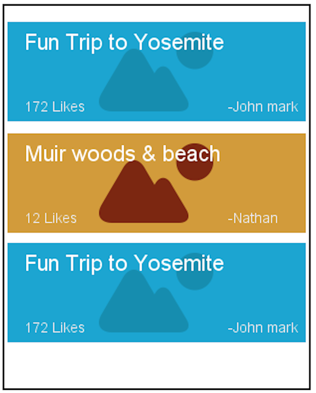
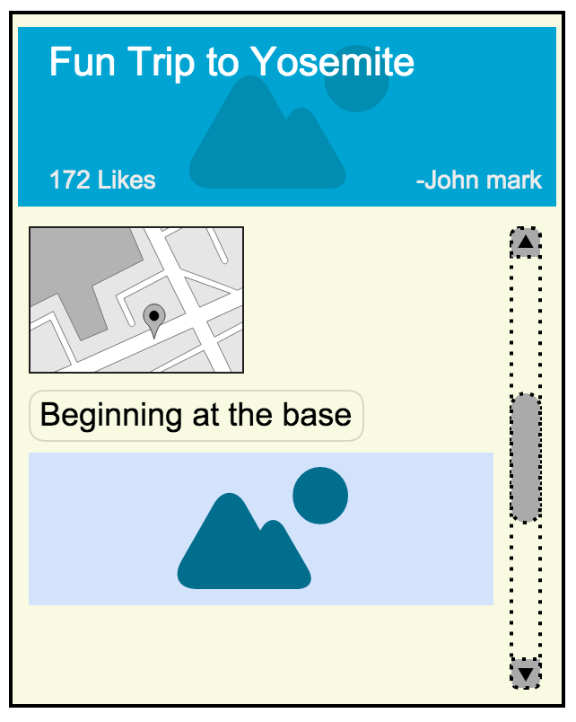
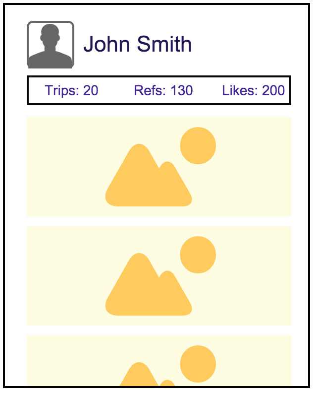

TrailGuide - Description
========================

We are avid hikers and travelers. We like to log and note interesting moments of our hiking experience by means of pictures. Users often take lots of pictures, share few pictures with locations on social networks. This setup seems very sparse and does not capture the true experience of entire hike.

Our app tries to provide a simple way to annotate users experience with help of notes, pictures and location. A hiking story is a beautiful automated compilation of users experiences before, during and after a hike. Once created the story can be shared with friends on the app's social network and also by means of web url. We envision that an immersive experience with maps, photos, location and user notes in a fluid UI helps tell the story the way user experienced.

The app is primarily focused on making it very easy to create, discover and enjoy the experiences with friends and for personal consumption. Additionally we aim to make the shared stories available for fellow hikers to discover new places and follow along to enjoy the same.

TrailGuide - Project Name Suggestions
=====================================

  * trailCompanion
  * trailBuddy
  * Explore
  * trailExplorer
  * BeActive
  * GetUGo
  * Elsewhere
  * Hiked
  * Hitchhike
  * OnceUponATime
  * Footsteps

TrailGuide User Stories
=======================

Required:

    1.  [Stream: Exploring shared/recommended trips]: In the main (opening) activity of the app, user should be able to see a list of recommended hikes (hiking stories) shared by other app users.
        a.  Each hiking story view in the list should comprise of a cover picture, title, number of likes, and plan reference count.
    2.  [Stream: Search trips] User should be able to enter a search query in the action bar.
    3.  [Detail: Hike in detail] A hiking story has two tabbed views (timeline and map). On opening the story the user is taken to the timeline view.
        a.  In the timeline view, user can view a timeline of events including pictures, user notes, etc. layed out beautifully.
        b.  In the map view, user can see the map of waypoints (rough path taken) with markers for information (notes and pictures at particular locations) of the hike.
        c.  If this is a hike user searched, user should be able to click the “Add to my hike” at the bottom of hike story detail view, which takes them to the login dialog(if required), which will let user create a hike or add to existing hike which he is planning.
    4.  [Profile view] If logged in, user should be able to click on the “profile action bar item” to go to their profile.
    5.  [Profile view] User profile comprises of name and profile thumbnail (a random pic like github) of user followed by list of his hikes (list similar to search) including saved hikes.
        a.  list example: [New] Day at Vernel falls Yosemite, Brunch at Muir woods.
        b.  The hike detail view of a finished hike is a story comprising of pictures, notes, trailed map, etc. and has the same detail view as mentioned in the user story 3.
        c.  User should be able to share the hike with an existing app user or an email address or facebook.
    6.  [Create/Hike details: New Hike] User can create a new hike by either clicking the + button on the action bar, or clicking the "Add to my hike" button while browsing through hiking stories if a new hike is not present.
        a.  Hike detail timeline view of a new hike is editable and should allow the user to edit hike title, and add notes.
        b.  In the hike detail map view of a new hike, user can see the rough paths and information points of the hikes he added to his plan (max 2).
        c.  In case of a new hike, user should be able to save hike offline (saves maps, notes, etc.) on device for referring on the go.
        d.  In case of a new hike, user should be able to click start hike and end hike buttons at the bottom of the timeline view.
        e.  After the hike is completed, user can click the "Create story" button, which instructs the app to obtain pictures, notes, gps data from the start to end of hike to contruct a visually complelling story.
        f.  User gets a notification when the story is completed on the server and available for viewing as a hike story in user's profile. (hike detail considers it as a completed hike). [Optional: notification, alternative toast when story is created]. 
        f.  Gotcha: User should be able to create a hike and its story even after the hike is completed.
        g. [Scoped out] User should be able to add another app user (the hike will get added to my hikes of the other user, as a new hike).
    6.  [Create: After hike, Moved to optional] If a user clicks "Create story" button without start/end hike, the assumption is user is trying to create a story with the existing pictures.
        a.  User can select photos from gallery or take one right from the interface.
        b.  User can add notes with a location in the timeline 
    7.  [Moved to optional] Data generated for the completed hike will be locally saved and user will have option to edit/review items until its published.
    8.  Upon publishing the hike story is uploaded to server and available for sharing or in search lists of other users.
    

Nice to have (optional):
========================

    1.  The main activity is divided into two sections:
        a.  My hikes (a carousel view of cover photos of user’s personal hikes)
        b.  Recommended (list of recommended hikes as in required stories)
    2.  The hiking story view in list should be a carousel of random pictures, other updates such as comments, etc. from the hike.
    3.  User profile has a status and user medal
        a.  User should be able to upload a profile picture.
        b.  Status - hiking “title of hike”/planning (if he has plans)/inactive
        c.  Medal/Level - beginner/intermediate hiker/climber/moutaineer/pro/beach boy/ready for everest, etc. (other fun levels, based on the hikes they undertake).
    4.  User should be able to get notifications during the hike about nearby scenic spots (based on the hikes he added to his plan).
    5.  User profile page should have a big “Create new hike story” button at the bottom which takes him to the gallery and lets him select start and end pictures.
    6.  User should be able to edit a hike story with comments, tags, hashtags, etc.
    7.  (Ref: Required:2) User should be able to set preferences for time, level and location (defaults in bold).
        a.  time (5-6 hours/weekend/4-5 days)
        b.  location (near me/reachable/don’t mind another country)
        c.  level (beginner/intermediate/adventurous/extreme/any)
    8. Add/Invite friends from facebook and twitter to participate in group hike creation
    9. [Might want to move to required] When the user clicks the start and end buttons, the app's background process collects location data from GPS sampled at a sparse interval (ex. 3 mins). This will help create detail trail map along with the timeline.

Mockups (work in progress):
===========================

    1. Home screen showing list of hikes with likes and title and cover photo
    

